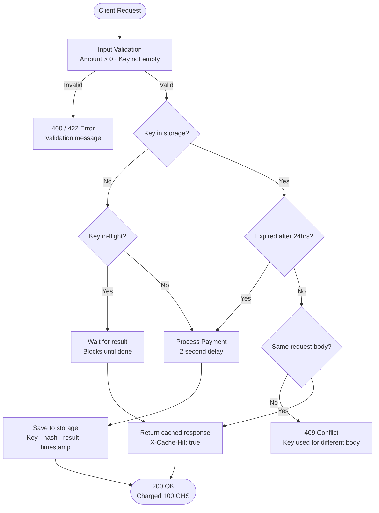

# Idempotency Gateway (The "Pay-Once" Protocol)

A payment processing API that ensures every transaction is processed **exactly once**, no matter how many times the request is retried.

---

## Table of Contents
1. [Architecture Diagram](#architecture-diagram)
2. [Setup Instructions](#setup-instructions)
3. [API Documentation](#api-documentation)
4. [Design Decisions](#design-decisions)
5. [Developer's Choice Feature](#developers-choice-feature)

---
## Architecture Diagram



---

## Setup Instructions

### Prerequisites
- Python 3.x
- Git

### Installation

1. **Clone the repository**
```bash
git clone https://github.com/YOUR-USERNAME/Idempotency-Gateway.git
cd Idempotency-Gateway
````

2. **Create and activate a virtual environment**

```bash
# Create virtual environment
python -m venv .venv

# Activate on Linux/Mac
source .venv/bin/activate

# Activate on Windows
.venv\Scripts\activate
```

3. **Install dependencies**

```bash
pip install -r requirements.txt
```

4. **Start the server**

```bash
uvicorn main:app --reload
```

5. **Open API documentation**

```
http://127.0.0.1:8000/docs
```

---

## API Documentation

### Endpoint

```
POST /process-payment
```

### Headers

|Header|Required|Description|
|---|---|---|
|`Idempotency-Key`|Yes|A unique string identifying this request|
|`Content-Type`|Yes|Must be `application/json`|

### Request Body

```json
{
  "amount": 100,
  "currency": "GHS"
}
```

|Field|Type|Description|
|---|---|---|
|`amount`|float|Payment amount (must be greater than 0)|
|`currency`|string|Currency code (e.g. GHS, USD)|

---

### Responses

#### ✅ First Request — 200 OK

```json
{
  "status": "success",
  "message": "Charged 100.0 GHS"
}
```

#### ✅ Duplicate Request — 200 OK

Same response as above but with an extra header:

```
X-Cache-Hit: true
```

#### ❌ Same Key, Different Body — 409 Conflict

```json
{
  "detail": "Idempotency key already used for a different request body."
}
```

#### ❌ Negative Amount — 422 Unprocessable Entity

```json
{
  "detail": "Amount must be greater than zero."
}
```

#### ❌ Empty Idempotency Key — 400 Bad Request

```json
{
  "detail": "Idempotency-Key header cannot be empty."
}
```

---

## Design Decisions

### 1. In-Memory Storage (Dictionary)

I used a Python dictionary to store processed payments. This is simple and fast for a prototype. In a production system, this would be replaced with a persistent database like **Redis** or **PostgreSQL** so data survives server restarts.

### 2. Body Hashing (MD5)

Instead of storing and comparing the entire request body, I convert it into a short unique fingerprint using MD5 hashing. This is faster and uses less memory.

### 3. Threading Lock

I used Python's `threading.Lock()` to make sure only one request can check or update the storage at a time. This prevents race conditions where two requests arrive simultaneously.

### 4. Threading Event

I used `threading.Event()` as a signaling mechanism. When two identical requests arrive at the same time, the second one waits for the first to finish instead of processing again or returning an error.

---

## Developer's Choice Feature

### Key Expiry (24 Hours)

**What it does:** Every idempotency key automatically expires after 24 hours.

**Why I added it:** In a real Fintech system, a retry from 5 minutes ago is likely a network retry and should be blocked. But a retry from 25 hours ago is most likely a brand new legitimate payment attempt. Keeping keys forever would:

- Waste memory over time
- Block legitimate payments unnecessarily

**How it works:** When a payment is saved, we record the current timestamp alongside it. Every time a request comes in with an existing key, we check if 24 hours have passed. If yes, we delete the old record and treat it as a fresh request.

---

## Extra Validations Added

Beyond the requirements, I added two extra safety checks:

|Validation|Error Code|Reason|
|---|---|---|
|Negative or zero amount|422|You cannot charge a negative amount in a real payment system|
|Empty Idempotency Key|400|A blank key would cause all requests to collide with each other|

---

## Tech Stack

|Tool|Purpose|
|---|---|
|Python|Programming language|
|FastAPI|Web framework for building the API|
|Uvicorn|ASGI server to run the application|
|Threading|Handle race conditions|

---

_Built as part of the AmaliTech Capstone Challenge_

